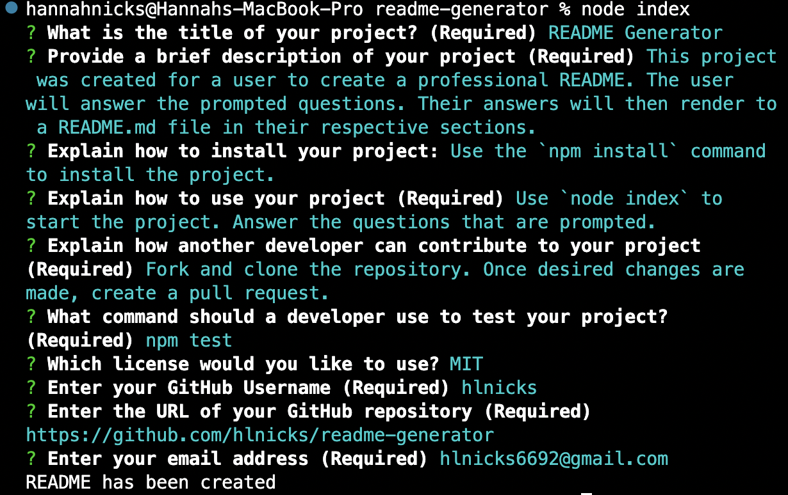
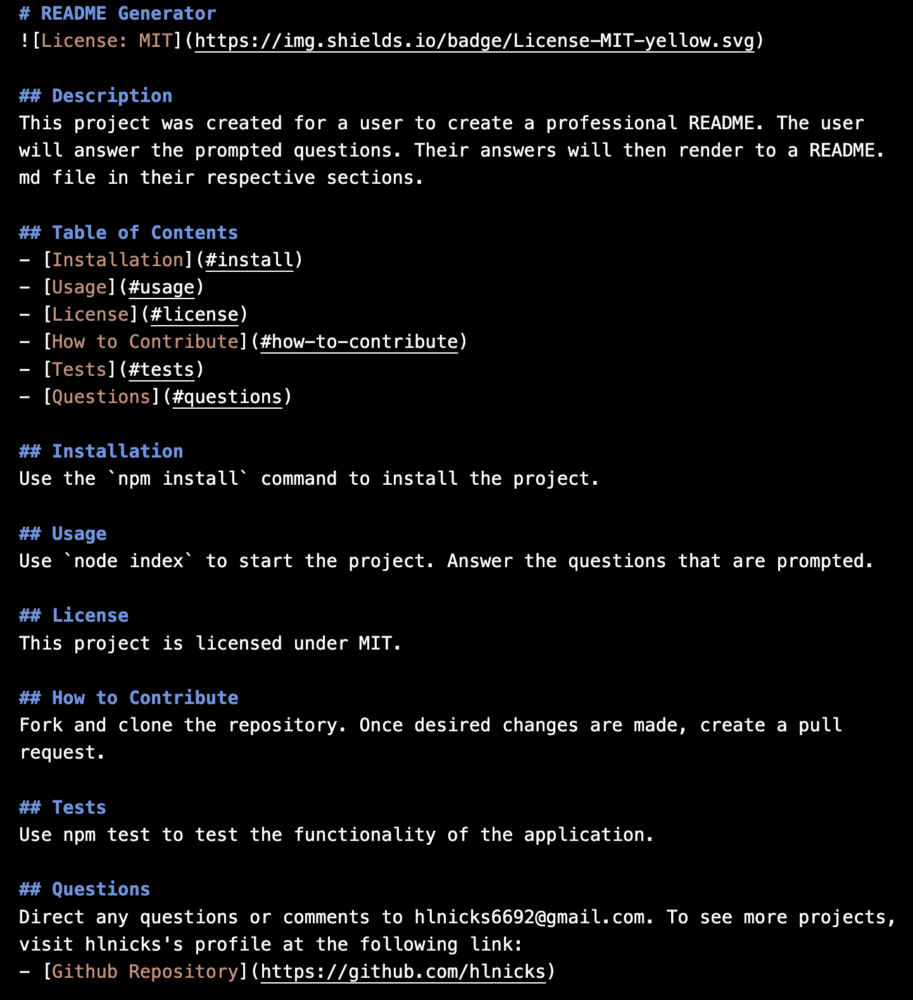
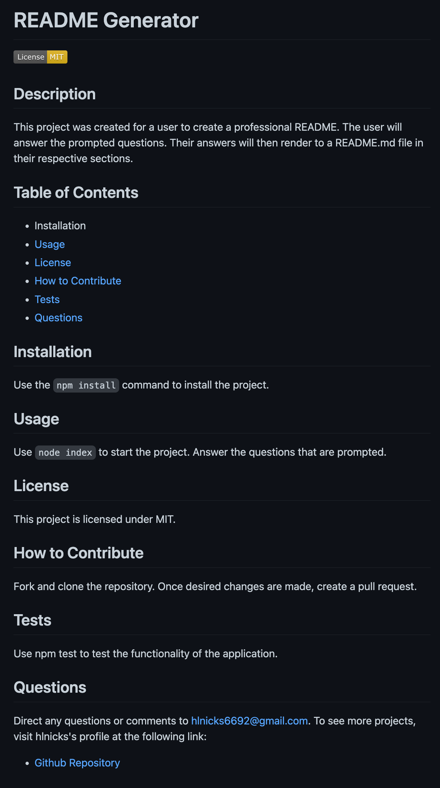

# README Generator

## Description
This project was created for a user to create a professional README. The user will answer the prompted questions. Their answers will then render to a README.md file in their respective sections.

## Screenshots
From CLI:

Example of rendered README.md

Preview of rendered README

## Links
- [Github Repository](https://github.com/hlnicks/readme-generator)

## Credits
- [Original Repository](https://github.com/coding-boot-camp/potential-enigma)
- [Markdown Badges](https://gist.github.com/lukas-h/2a5d00690736b4c3a7ba)